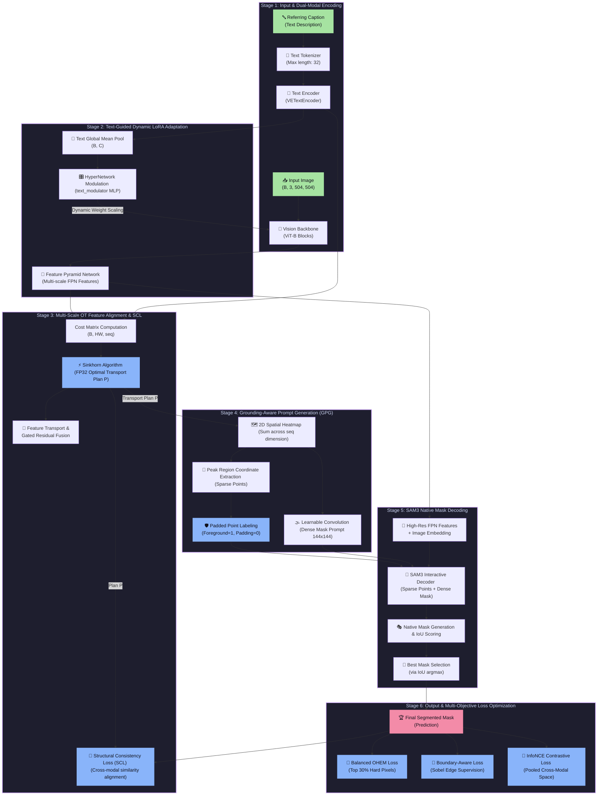

# 🚀 Enhanced_RRSIS_UOT: Comprehensive System Architecture & Data Flow

Aapke system ka **poora working aur data flow (Input se Output tak)** bohot hi advance aur state-of-the-art cross-modal architecture par mabni hai. Is document mein poore pipeline ko Roman Urdu mein **stages** ke tehat details aur beautiful multi-stage Mermaid diagram ke sath samjhaya gaya hai takay aapko model ke functional components aur dynamic interactions ka mukammal andaza ho sake.

---

## 📊 End-to-End System Architecture (Multi-Stage Flow)

Niche diya gaya Mermaid diagram system ke poore flow ko alag-alag logical stages mein divide karta hai:

---

## 🧩 Step-by-Step Detailed Functional Stages

### 🎬 Stage 1: Input & Dual-Modal Encoding

Yeh hamare system ki base stage hai jahan multi-modal input channels ko model-compatible embeddings mein tabdeel kiya jata hai.

1. **Input Dimensions**:
   * **Image**: Remote sensing images ko standard shape `(B, 3, 504, 504)` mein pass kiya jata hai. remote sensing data mein target objects bohot chote ya complex scale par hote hain, isliye `504x504` resolution fine details retain karne mein madad karti hai.
   * **Text Caption**: Ek target-specific natural language expression hota hai (e.g., *"the rectangular swimming pool near the residential building"*).

2. **Text Processing & Tokenization**:
   * Input expression ko **Tokenizer** ke zariye max 32 tokens mein break kiya jata hai. Agar sentence chota ho, toh usko dynamically padding tokens ke sath fill kiya jata hai.
   * Tokenized representation **VETextEncoder** ke paas bheji jati hai jo har word aur word-relation ko analyze kar ke dense syntactic/semantic representations generate karti hai.
   * **Output**: Text embeddings of shape `(seq, B, C)` generate hoti hain, jahan `seq = 32` hai aur `C = 256` channel feature size hai.

---

### 🎨 Stage 2: Text-Guided Dynamic LoRA Adaptation

Standard vision backbones static visual feature extraction karte hain jo input caption se be-khabar hoti hain. Humne yahan **Text-Guided Dynamic LoRA** lagaya hai jo vision encoder ko text ki guidance ke tehat dynamically shape karta hai.

1. **Global Text Pooling**:
   * Sabse pehle, text features `(seq, B, C)` ka mean pool `(B, C)` nikala jata hai takay pooray caption ki aik global semantic meaning (summary vector) mil sake.

2. **HyperNetwork Modulation (`text_modulator`)**:
   * Yeh summary vector ek dynamic **MLP (Multi-Layer Perceptron)** layer se guzarta hai jo ek **scale factor** (ya modulation parameter) predict karta hai.
   * Yeh output dynamic weight modulation vectors banate hain.

3. **In-Backbone Adaptation**:
   * Jab visual image `ViT` (Vision Transformer) backbone ke blocks se guzarti hai, toh self-attention layer mein dynamic scaling weights inject hote hain.
   * Is se ViT encoder **pehli hi layer se text-aware** ho jata hai. Model sirf un features ko activate karta hai jo text description ke semantic properties ke sath match karti hain.

4. **Output (FPN Pyramids)**:
   * Vision backbone se humein **FPN (Feature Pyramid Network)** ke dynamic multi-scale representations `(fine-to-coarse scales)` milti hain jo target objects ko small, medium aur large scales par hold karti hain.

---

### 📐 Stage 3: Multi-Scale Optimal Transport (OT) Feature Alignment & SCL

Visual aur textual feature maps alag ranges mein hote hain, jis ki wajah se directly dot product mismatch produce karta hai. Hum yahan **Optimal Transport (OT)** algorithm lagate hain takay globally optimal mathematical matching achieve ki ja sake.

1. **Cost Matrix Computation**:
   * Multi-scale FPN features `(B, HW, C)` aur Text tokens `(B, seq, C)` ke darmiyan negative cosine similarity use kar ke ek cost matrix calculate kiya jata hai jis ki shape `(B, HW, seq)` hoti hai. Yeh matrix har image pixel ka har word token ke sath distance (cost) batata hai.

2. **Sinkhorn-Knopp Solver (FP32 Precision)**:
   * Cost matrix par FP32 precision ke sath **Sinkhorn Algorithm** run hota hai jo dynamically transport plan $P$ compute karta hai (shape: `(B, HW, seq)`).
   * Yeh matrix globally optimize karti hai ke kis pixel feature ko kis text token par distribute kiya jaye. **FP32 numerical stability** ki wajah se computational values flow control mein rehti hain.

3. **Feature Transport & Fusion**:
   * Transport plan $P$ ko use kar ke text features ko exact image plane coordinates par warp kiya jata hai, aur visual maps ke sath ek specialized **Gated Residual Fusion Block** ke zariye integrate kar diya jata hai.

4. **Structural Consistency Loss (SCL)**:
   * **Text-to-Visual Graph Alignment**: Text features ka aapas mein pairwise similarity matrix $S_{txt}$ generate hota hai.
   * **Projected Visual Space**: Transport plan $P$ ka transpose le kar visual features ko project kiya jata hai aur scale-normalized relational matrix $S_{img\_proj}$ nikala jata hai.
   * Dono structures par **Mean Squared Error (MSE)** loss apply hota hai jo force karta hai ke dono modalities ke cross-relation graphs overlapping hon.

---

### 📍 Stage 4: Grounding-Aware Prompt Generation (GPG)

Visual coordinates aur multi-modal correlation plans ko coordinate prompts mein convert karna standard models mein bottleneck hota tha jo coordinate indexing anomalies ki wajah se crash ho jata tha. **GPG** isko dynamically solve karta hai:

1. **2D Spatial Heatmap Extraction**:
   * Sinkhorn output transport plan $P$ ko text sequence `(seq)` axis ke upar sum (collapse) kiya jata hai. Is se `(B, 504, 504)` space ke tehat ek robust **2D spatial heatmap** milti hai jo batati hai ke target object ki visual location kahan par sabse high probability par hai.

2. **Sparse Points & Dense Mask Extraction**:
   * Spatial heatmap ke extreme local peaks se coordinate extraction logic laga kar **Sparse Points** select kiye jaate hain.
   * Usi waqt, ek learnable convolution block us heatmap ko smooth aur normalize kar ke ek **Dense Mask Prompt** (144x144) generate karta hai.

3. **CUDA-Safe Padded Labeling**:
   * Jo real positive coordinates hote hain unko foreground label `1` diya jata hai.
   * Padding coordinates ko `-1` se safe index `0` par map kar diya jata hai takay indexing crash na ho.

---

### 🧠 Stage 5: SAM3 Native Mask Decoding

Pichle version mein yahan DETR-based 200-query decoder use hota tha jo gradients ko dead (vanish) kar deta tha. Ab uski jagah Native SAM3 Interactive Decoder use ho raha hai:

1. **Feature Integration**:
   * Backbone FPN features ko **High-Res Features** aur **Image Embeddings** mein extract kar ke direct SAM3 decoder ke native interface mein bheja jata hai.

2. **Native Mask Decoder**:
   * Decoder mein extract kiye gaye **Sparse Points** aur **Dense Mask Prompt** ko feed kiya jata hai. Yeh prompts directly query attention mechanisms ko dense prior dete hain, jis se bounding object asani se shape pakar leta hai.

3. **IoU-Based Selection**:
   * SAM3 natively multiple hypotheses generate karta hai aur sath unke quality IoU scores predict karta hai. Hum highest IoU score wale mask ko argmax ke zariye select kar lete hain. Iski wajah se ab 200 queries ko aapas mein conflict karne ka masla khatam ho gaya hai.

---

### 🎯 Stage 6: Output & Multi-Objective Loss Optimization

Inference time par directly visual mask output ho jata hai. Training time par following objectives optimize hote hain takay target performance (**mIoU: ~74%, oIoU: ~84%**) achieve ki ja sake:

1. **Balanced OHEM Loss**:
   * Binary Cross-Entropy (BCE) check kiya jata hai. Sirf top 30% **hardest pixels** (OHEM selection) par weight optimization hoti hai takay object borders aur high-noise visual classes par accurate masking ho.

2. **Text-Guided Boundary Loss (TBL)**:
   * Ground Truth mask par **Sobel Operators** lagaye jaate hain takay structural edges generate ho saken. Uske baad in edges ko text-attention map ke sath scale kiya jata hai takay sirf relevant boundaries par focal dice loss apply ho. Yeh object ke kinaro (edges) ko sharp karta hai.

3. **Contrastive InfoNCE Loss**:
   * Global spatial masks ke localized features aur text context embeddings ke darmiyan high cosine alignment force karta hai, jis se out-of-context misclassifications eliminate ho jati hain.

4. **Structural Consistency Loss (SCL)**:
   * Multi-scale layers par geometric structures aur relational spaces ko align rakhta hai.

---

## 🛠️ Performance Metrics Target & Benefits

Yeh advanced pipeline design custom loss optimizations aur stable GPU fine-tuning configs (`fine.sh`) ke sath direct high performance deliver karne ke liye design kiya gaya hai:
* **oIoU Target**: **~84%**
* **mIoU Target**: **~74%**
* **Overfitting / Underfitting Safeguards**: Text-guided dynamic LoRA aur strict optimal transport metrics feature representation boundaries ko strictly constrain karte hain, jo validation steps par absolute high generalization provide karti hain.
